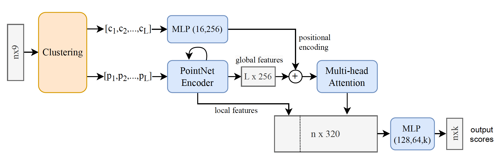
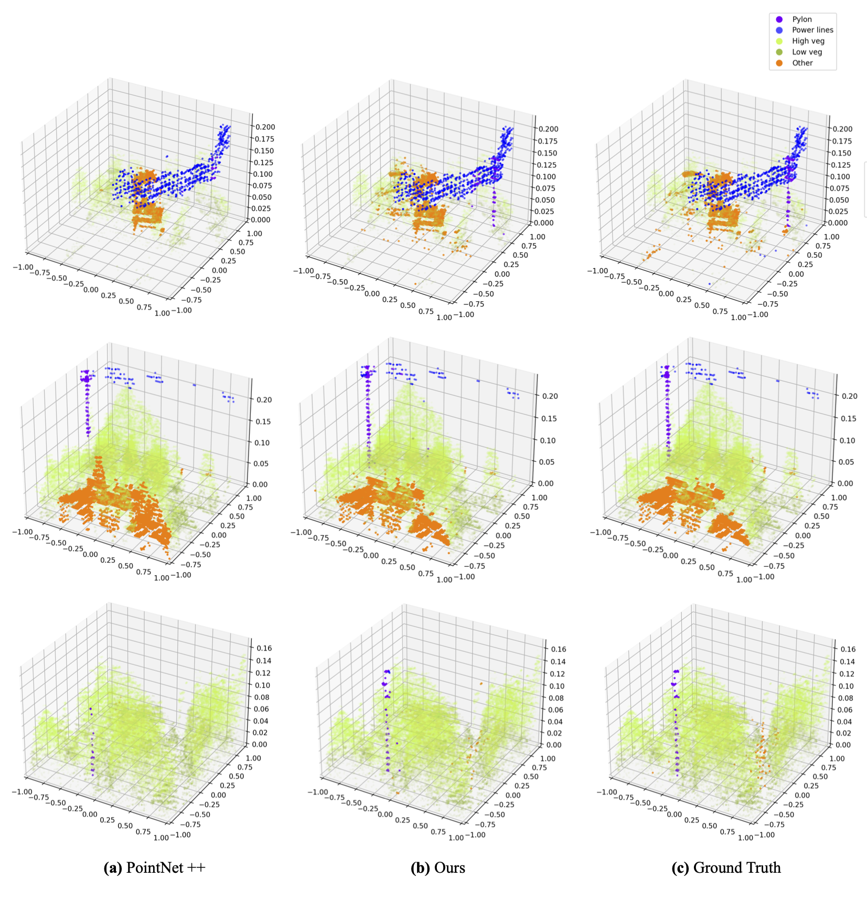

# Attention-enhanced Multi-PointNet: A Solution for Segmenting Arbitrary-Scale Point Clouds
3D segmentation on ALS data with Deep Learning

## Installation
The code has been tested with Python 3.8, [Pytorch](https://pytorch.org/) v1.8, CUDA 11.7  on Ubuntu 20.04. <br />
You may also need to install ```pdal``` library to transform height above sea (HAS) data into height above ground (HAG).<br />
```
pip install pdal
```


## Usage
Execute the following commands from the main directory.

### Preprocessing

First, execute:
```
python data_proc/1_get_windows_split.py --LAS_files_path path/LAS_files/here
```
This function splits our dataset into windows of a fixed size 

Then, use PDAL library to get HAG data by executing the following code for all .LAS files: <br />
```
pdal translate $input_file $output_file hag_nn --writers.las.extra_dims="HeightAboveGround=float32"
```

Finally, run:
```
python data_proc/2_preprocessing_filter_norm.py 
```
This function first removes ground and points above 100 meters and then normalized each feature according to the paper. <br />


### Semantic Segmentation




To train models use:<br />
```
python pointNet/train_segmentation.py $data_path --path_list_files $list_files_split_path  --batch_size 32 --epochs 50 --learning_rate 0.001 --weighing_method EFS --number_of_points 2048 --number_of_workers 4 --c_sample True
```
For model inference use:<br />
```
python pointNet/test_segmentation.py /dades/LIDAR/towers_detection/datasets pointNet/results/ --number_of_points 2048 --number_of_workers 0 --model_checkpoint
```
## Results


## License
Our code is released under MIT License (see LICENSE file for details).
